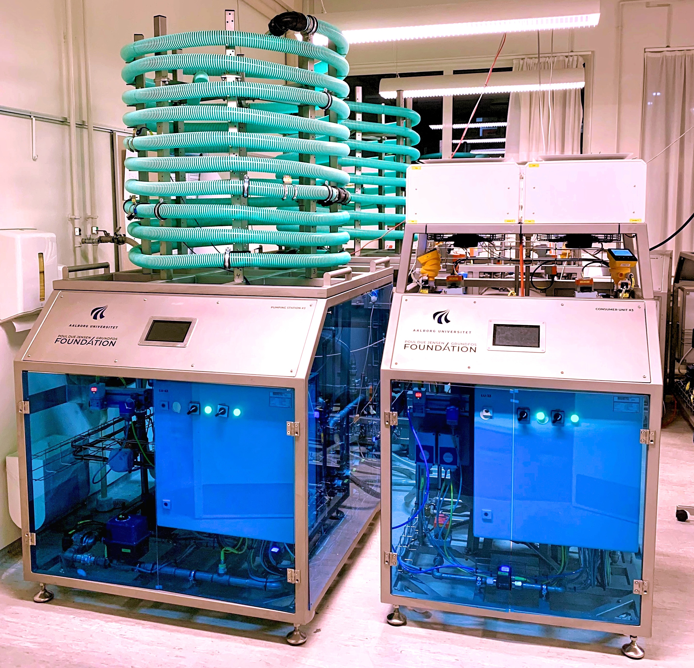

# A Learning-based Approach Towards the Data-driven Predictive Control of Wastewater Networks – An Experimental Study

## Table of contents
* [General info](#general-info)
* [Tools](#tools)
* [Documentation](#documentation)
* [Simulator](#simulator)
* [Data collection](#data-collection)
* [GP-MPC controller](#GP-MPC-controller)

## General info
This repository is a how-to documentation for the control toolchain designed in the work: "A Learning-based Approach Towards the Data-driven Predictive Control of Wastewater Networks – An Experimental Study". The project description is the following: 

>The abstract goes here. The abstract goes here. The abstract goes here. The abstract goes here. The abstract goes here. The abstract goes here. The abstract goes here. The abstract goes here. The abstract goes here. The abstract goes here. The abstract goes here. The abstract goes here. The abstract goes here. The abstract goes here. The abstract goes here. The abstract goes here. The abstract goes here. The abstract goes here. The abstract goes here. The abstract goes here. The abstract goes here.

The project is created with the following tools: 
* _Casadi_ (https://web.casadi.org/docs/) : To solve and simulate all dynamic optimization included in this project.
* _fitrgp()_ (https://se.mathworks.com/help/stats/fitrgp.html): To obtain the hyperparameters through Bayesian optimization with Gaussian Process regression.
* _Simulink_ (https://www.mathworks.com/products/simulink.html) : To deploy the real-time controller to the experimental setup with ModBus.
* _CodeSys_ (https://www.codesys.com/) : To control valves, pumps and tank units on the setup through virtual PLCs.
	
## Tools
Tools designed specifically for the Smart Water Laboratory experiments carried out in the project
* Manual control
* Lab setup initialization

## Documentation
Detailed documentation with illustrations for the topological layout and the physical description of the expereimental setup. 
* WW Lab setup (pdf)
	
## Simulator
An exact simulator designed specifically for the experimental setup. The simulator represents the equivalent of the Smart Water Lab. The purpose of this simulator is the reproducability of the tests in simulation in case the laboratory access is out of scope. The modelling used in the simulator setup is from the following article: 

>Balla, KM, Schou, C, Bendtsen, JD, Ocampo-Martinez, C & Kallesøe, C 2021, 'A Nonlinear Predictive Control Approach for Urban Drainage Networks Using Data-Driven Models and Moving Horizon Estimation', IEEE Transactions on Control Systems Technology.

* simulator PDE based
* simulator GP

## Data collection
Randomized Onoff, rule-based Onoff and closed loop deterministic MPC data collection scripts for the experimental setup. 
* Onoff randomized data collection
* Rule-based Onoff data collection

## GP-MPC controller
The closed-loop controller deployed to the Smart Water Laboratory.  

